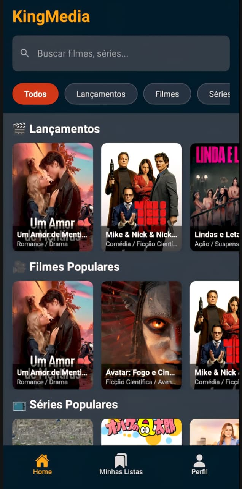

# 👑 kingMedia

App de streaming e catálogo de filmes e séries, desenvolvido com [Expo](https://expo.dev) e React Native.

## 📱 Screenshots

<p align="center">
  
  
  
  
</p>

<p align="center">
  
</p>

| Login | Biblioteca | Filmes | Séries |
|:---:|:---:|:---:|:---:|
| Tela de autenticação | Catálogo geral de mídias | Catálogo de filmes | Catálogo de séries |

## ✨ Funcionalidades

- 🔐 **Login** — autenticação de usuário
- 📚 **Biblioteca** — catálogo geral com todas as mídias cadastradas
- 🎬 **Filmes** — catálogo com detalhes dos filmes
- 📺 **Séries** — catálogo com detalhes das séries

## 🚀 Get started

1. Instale as dependências

   ```bash
   npm install
   ```

2. Inicie o app

   ```bash
   npx expo start
   ```

No output, você vai encontrar opções para abrir o app em:

- [development build](https://docs.expo.dev/develop/development-builds/introduction/)
- [Android emulator](https://docs.expo.dev/workflow/android-studio-emulator/)
- [iOS simulator](https://docs.expo.dev/workflow/ios-simulator/)
- [Expo Go](https://expo.dev/go), um sandbox limitado para testar o desenvolvimento de apps com Expo

Você pode começar a desenvolver editando os arquivos dentro do diretório **app**. Este projeto usa [file-based routing](https://docs.expo.dev/router/introduction).

## 🛠️ Tecnologias

- [Expo](https://expo.dev)
- React Native
- React Navigation / Expo Router

## 🔄 Get a fresh project

Quando estiver pronto, execute:

```bash
npm run reset-project
```

Este comando vai mover o código inicial para o diretório **app-example** e criar um diretório **app** em branco para você começar a desenvolver.

## 📚 Learn more

Para aprender mais sobre como desenvolver seu projeto com Expo, veja os seguintes recursos:

- [Expo documentation](https://docs.expo.dev/): Aprenda os fundamentos, ou se aprofunde em tópicos avançados com nossos [guides](https://docs.expo.dev/guides).
- [Learn Expo tutorial](https://docs.expo.dev/tutorial/introduction/): Siga um tutorial passo a passo onde você vai criar um projeto que roda em Android, iOS e web.

## 🌐 Join the community

Junte-se à nossa comunidade de desenvolvedores criando apps universais.

- [Expo on GitHub](https://github.com/expo/expo): Veja nossa plataforma open source e contribua.
- [Discord community](https://chat.expo.dev): Converse com usuários do Expo e tire suas dúvidas.
